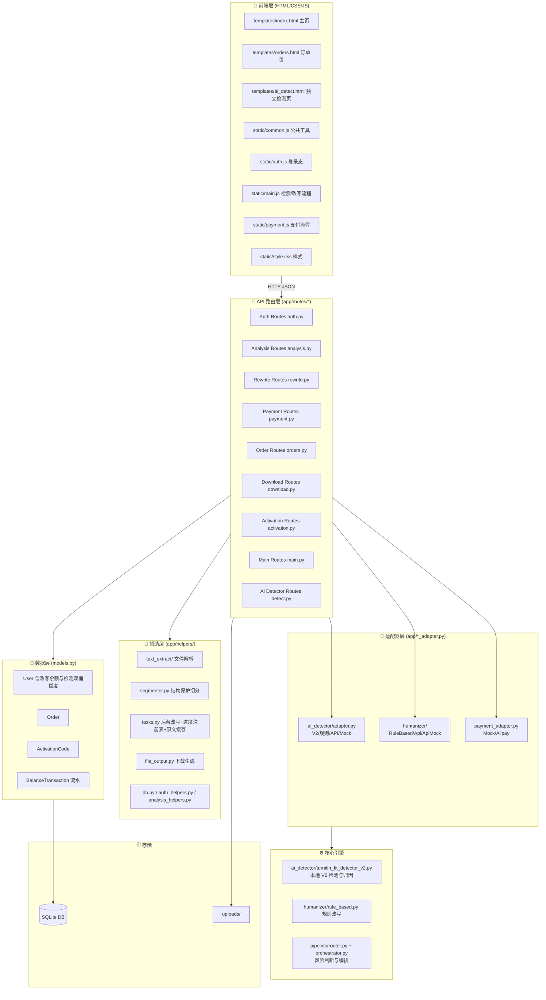
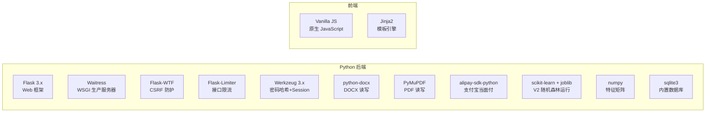
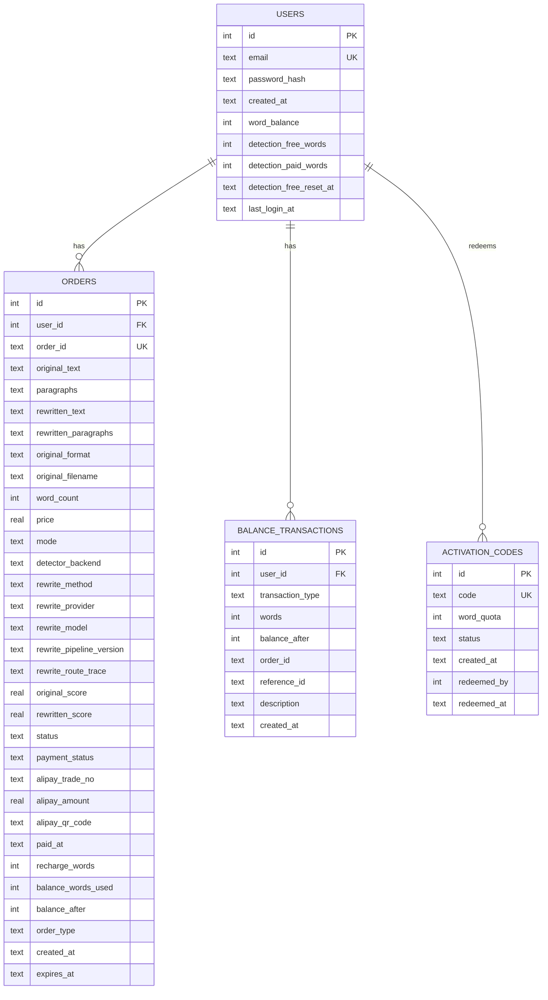
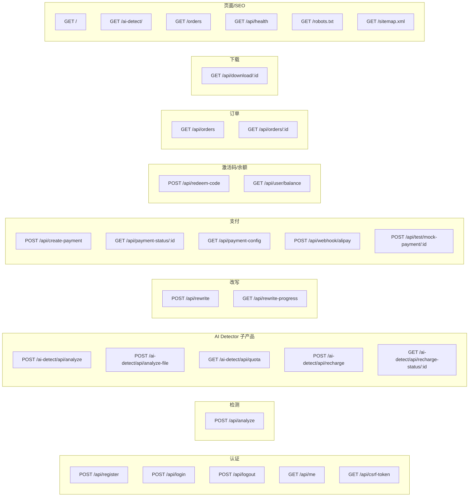
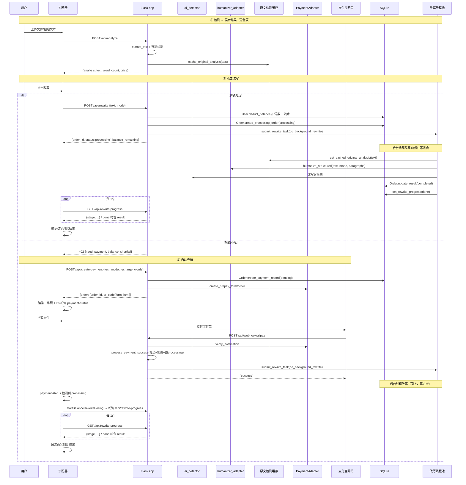
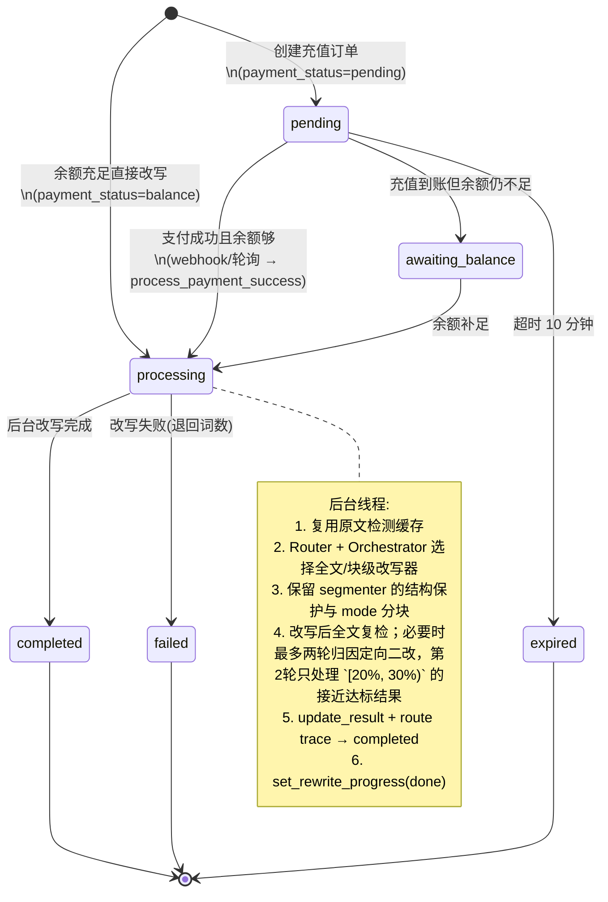
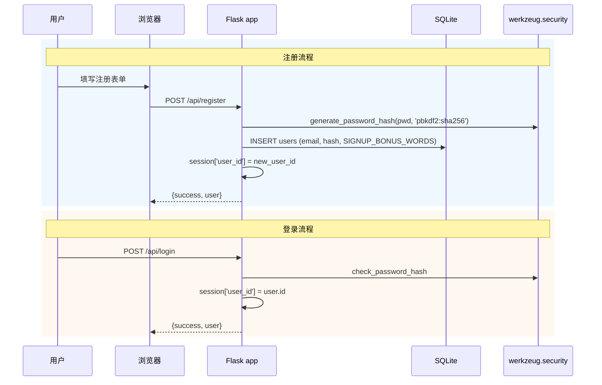
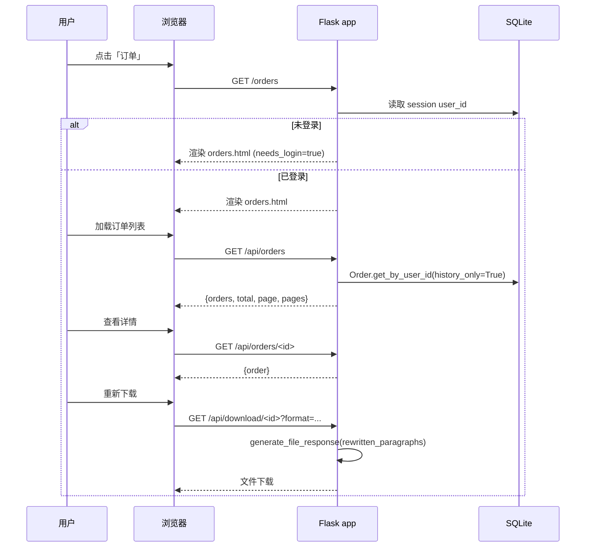
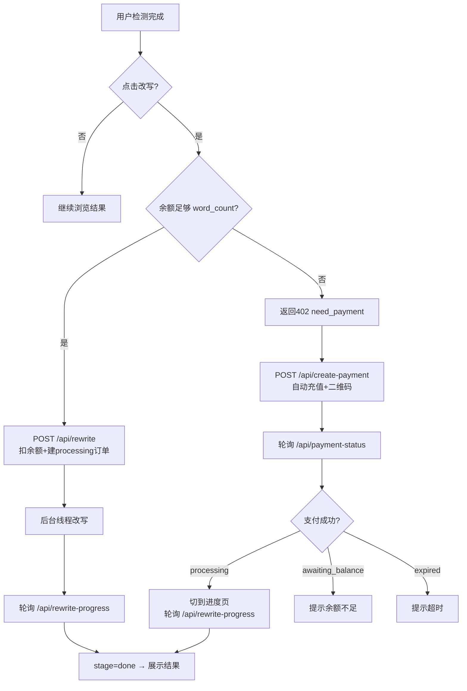
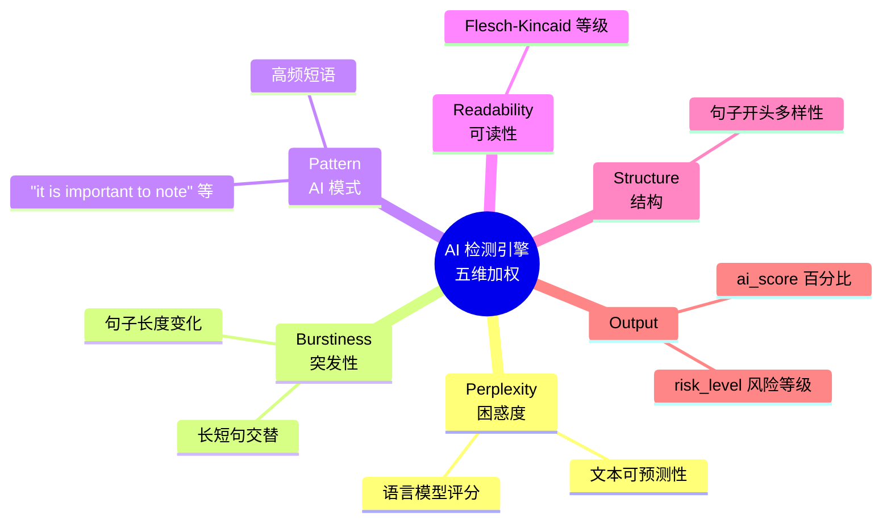

# Huma - 技术方案

> **版本**: v2.1 | **日期**: 2026-09-09 | **状态**: 对齐 v2 本地检测器（turnitin_fit_detector_v2）、风险分档路由、归因定向二改、AI Detector 独立检测页与检测额度
>
> 本文档基于当前代码实际结构维护。覆盖：应用工厂 + 蓝图路由、三适配器模式、异步改写统一流程、真实进度轮询、v2 检测引擎、余额体系、结构保护、数据模型、API 接口。检测器默认实现与页面产品结构以第 7 章顶部说明为准。

---

## 目录

- [1. 系统架构总览](#1-系统架构总览)
- [2. 技术栈](#2-技术栈)
- [3. 架构模式](#3-架构模式)
- [4. 数据模型](#4-数据模型)
- [5. API 接口](#5-api-接口)
- [6. 核心流程](#6-核心流程)
- [7. 检测引擎](#7-检测引擎)
- [8. 改写引擎](#8-改写引擎)
- [9. 文件结构](#9-文件结构)
- [10. 共享约定与配置](#10-共享约定与配置)
- [11. 待实施技术方案与已知限制](#11-待实施技术方案与已知限制)

---

## 1. 系统架构总览


### 分层架构



---

## 2. 技术栈

### 依赖矩阵



### 选型理由

| 库/框架 | 版本 | 用途 | 选型理由 |
|---------|------|------|----------|
| Flask | >=3.0,<4.0 | Web 框架 | 轻量、灵活、成熟 |
| waitress | >=3.0,<4.0 | 生产 WSGI 服务器 | 纯 Python 跨平台部署 |
| Flask-WTF | >=1.2,<2.0 | CSRF 防护 | 保护所有 POST 接口 |
| Flask-Limiter | >=3.5,<4.0 | 接口限流 | 内存存储，防滥用 |
| Werkzeug | >=3.0,<4.0 | 密码哈希 + session | Flask 内置依赖 |
| python-docx | >=1.0,<2.0 | .docx 读写 | 标准 DOCX 处理库 |
| PyMuPDF | >=1.20,<2.0 | .pdf 读写 | 高性能 PDF 处理 |
| alipay-sdk-python | >=3.7,<4.0 | 支付宝当面付 | 官方 SDK |
| numpy / joblib / scikit-learn | 见 requirements.txt | V2 特征与随机森林推理 | 本地推理，不产生检测 API 费用 |
| aliyun-python-sdk-core / alimt | 见 requirements.txt | Lynote 翻译链兜底 | 百度机器翻译失败时切换阿里云 |
| sqlite3 | Python 内置 | 数据库 | 零依赖，适合单机 |
| Vanilla JS | — | 前端 | 无框架依赖，轻量 |

---

## 3. 架构模式

### 3.1 核心设计模式

**模式一：应用工厂 + 蓝图 (Factory + Blueprint)**
- `app.py` 仅 15 行，委托 `app.create_app()` 创建 Flask 实例
- 路由按领域拆分为 9 个 Blueprint：`main / auth / analysis / rewrite / payment / download / orders / activation / detect`
- 全局可共享对象（csrf、limiter、适配器）集中放 `app/extensions.py`

**模式二：适配器模式 (Strategy)**
三个核心组件都使用适配器，通过 `config.py` 的配置项切换实现：

| 组件 | 适配器文件 | 可选实现 | 切换配置 |
|------|-----------|---------|----------|
| 检测 | `ai_detector/adapter.py` | TurnitinFitDetectorV2（默认）/ RuleBased / Sapling / Originality / SaplingMock / RuleBasedMock | `AI_DETECTOR_ADAPTER` |
| 改写 | `humanizer/` | RuleBased / AITextHumanizer / LLMBased / Mock / Failover | `HUMANIZER_ADAPTER` + `HUMANIZER_FALLBACK_ADAPTER` |
| 支付 | `payment_adapter.py` | Mock / Alipay | `PAYMENT_ADAPTER` |

> 检测侧最新默认实现是本地 `turnitin_fit_detector_v2`（以 Turnitin 真实评分拟合的随机森林，
> 见 [v2 检测分档与改写路由改造方案](v2检测分档与改写路由改造方案.md) 与
> [v2 归因方法与失败样本分析](v2归因方法与5篇失败样本分析.md)）。独立检测产品页
> `/ai-detect/`（AI Detector）与主改写流程共用该检测实例，相关上线说明见
> [V2 检测与 AI Detector 上线说明](V2检测与AI-Detector上线说明.md)。

```mermaid
flowchart TB
    subgraph Detector["检测适配器"]
        D0[create_detector(name)<br>→ analyze_text(text, stage)]
        D5[TurnitinFitDetectorV2<br>本地随机森林 · 默认]
        D1[RuleBasedDetector<br>本地规则]
        D2[SaplingApiDetector<br>Sapling.ai API]
        D3[OriginalityDetector<br>Originality.ai API]
        D4[MockDetector<br>随机 sleep 1-1.5s]
    end

    subgraph Humanizer["改写适配器"]
        H0[HumanizerAdapter<br>抽象接口]
        H1[RuleBasedHumanizer<br>本地规则]
        H2[AITextHumanizer<br>ai-text-humanizer.com]
        H3[AITextHumanizerMock<br>随机 sleep 1-1.5s]
        H4[LLMBasedHumanizer<br>DeepSeek / OpenCode]
        H5[FailoverHumanizer<br>主备自动切换]
    end

    subgraph Payment["支付适配器"]
        P0[PaymentAdapter<br>抽象接口]
        P1[MockPaymentAdapter<br>开发测试]
        P2[AlipayPaymentAdapter<br>生产环境]
    end

    App[Flask App] -.->|uses| D0
    D0 --> D1
    D0 --> D2
    D0 --> D3
    D0 --> D4
    App -.->|uses| H0
    H0 <|-- H1
    H0 <|-- H2
    H0 <|-- H3
    H0 <|-- H4
    H0 <|-- H5
    H5 --> H2
    H5 --> H4
    App -.->|uses| P0
    P0 <|-- P1
    P0 <|-- P2
```

> **Mock 适配器**：`sapling_mock / rule_based_mock / ai_text_humanizer_mock` 用于本地测试“改写/检测进行中”的等待界面，不真实请求外部 API。

**模式三：异步后台任务**
- 改写统一通过 `submit_rewrite_task()` 投递到 `rewrite_executor`（`ThreadPoolExecutor(max_workers=5)`）执行 `do_background_rewrite`
- 不阻塞支付 Webhook 响应 / API 响应，保证及时返回
- 线程池暂时拒绝任务时按指数退避持续重投，订单保留 `processing`；启动时 `recover_processing_orders()` 继续恢复

### 3.2 核心技术挑战与应对

| 挑战 | 应对方案 |
|------|----------|
| 用户认证 | `werkzeug.security` 哈希密码 + Flask session |
| 文件系统 Session | `app/session.py` 自定义 `FileSystemSessionInterface`，避免默认 Cookie 体积限制 |
| 订单持久化 | SQLite 存储，支持历史查询和结果重新下载 |
| 格式保持输出 | python-docx 写 docx, PyMuPDF 写 pdf, 直接写 md/txt |
| 支付可扩展 | 适配器模式 — MockPaymentAdapter + AlipayPaymentAdapter |
| 改写引擎可替换 | `LLMBasedHumanizer`、`AITextHumanizer`、`RuleBasedHumanizer`，可用 `FailoverHumanizer` 组合主备 |
| 检测与改写组合 | `pipeline/router.py` 只做风险决策，`pipeline/orchestrator.py` 负责全文/块级检测、改写器选择、复检和定向二改 |
| 上游请求保护 | 公共按段落/句子/词切块；当前进程跨订单共享并发上限和最小请求间隔 |
| 检测引擎可替换 | 适配器模式 — TurnitinFitDetectorV2 + RuleBased + Sapling + Originality + Mock |
| 异步改写统一 | `do_background_rewrite` + 线程池，余额/支付两场景共用 |
| 真实进度 | 内存进度注册表 `_REWRITE_PROGRESS`，按 order_id 记录 |
| 重复原文检测 | D 方案缓存 `_ORIGINAL_ANALYSIS_CACHE`，改写复用 /api/analyze 结果 |
| CSRF | Flask-WTF + 前端 `_csrfFetch` 统一注入 X-CSRFToken；支付 Webhook 与现有兼容接口按白名单豁免 |

---

## 4. 数据模型

### 4.1 数据库 ER 图



### 4.2 表结构

```sql
CREATE TABLE users (
    id INTEGER PRIMARY KEY AUTOINCREMENT,
    email TEXT UNIQUE NOT NULL,
    password_hash TEXT NOT NULL,
    created_at TEXT NOT NULL,
    word_balance INTEGER DEFAULT 0,       -- 词数余额
    last_login_at TEXT,
    detection_free_words INTEGER DEFAULT 1000,
    detection_paid_words INTEGER DEFAULT 0,
    detection_free_reset_at TEXT
);

CREATE TABLE orders (
    id INTEGER PRIMARY KEY AUTOINCREMENT,
    user_id INTEGER REFERENCES users(id),
    order_id TEXT UNIQUE NOT NULL,
    original_text TEXT NOT NULL,
    paragraphs TEXT,                      -- 原始段落结构（JSON，供结构保护）
    rewritten_text TEXT,
    rewritten_paragraphs TEXT,            -- 改写后结构化段落（JSON，下载重建标题格式）
    original_format TEXT DEFAULT 'txt',
    original_filename TEXT,
    word_count INTEGER,
    price REAL,
    mode TEXT DEFAULT 'low',              -- low/median/high 改写粒度
    detector_backend TEXT,                -- 实际检测器
    rewrite_method TEXT,                  -- 订单主改写方法
    rewrite_provider TEXT,
    rewrite_model TEXT,
    rewrite_pipeline_version TEXT,
    rewrite_route_trace TEXT,             -- JSON：全文/分块路由和二改记录
    original_score REAL,
    rewritten_score REAL,
    status TEXT DEFAULT 'pending',        -- pending/processing/completed/expired/failed/awaiting_balance
    payment_status TEXT DEFAULT 'pending',-- pending/free/balance/paid/expired/failed
    alipay_trade_no TEXT,
    alipay_amount REAL,
    alipay_qr_code TEXT,
    paid_at TEXT,
    recharge_words INTEGER DEFAULT 0,     -- 本次充值词数
    balance_words_used INTEGER DEFAULT 0, -- 任务使用原有余额词数
    balance_after INTEGER,                -- 任务完成后余额
    order_type TEXT DEFAULT 'recharge',   -- recharge/product/detect_recharge
    created_at TEXT NOT NULL,
    expires_at TEXT NOT NULL              -- = created_at + 7 天
);

CREATE TABLE activation_codes (
    id INTEGER PRIMARY KEY AUTOINCREMENT,
    code TEXT UNIQUE NOT NULL,
    word_quota INTEGER NOT NULL,
    status TEXT DEFAULT 'unused',         -- unused/redeemed
    created_at TEXT NOT NULL,
    redeemed_by INTEGER REFERENCES users(id),
    redeemed_at TEXT
);

CREATE TABLE balance_transactions (
    id INTEGER PRIMARY KEY AUTOINCREMENT,
    user_id INTEGER NOT NULL REFERENCES users(id),
    transaction_type TEXT NOT NULL,       -- 含改写充值/消耗/退款、激活码、检测充值/消耗
    words INTEGER NOT NULL,
    balance_after INTEGER NOT NULL,
    order_id TEXT,
    reference_id TEXT,
    description TEXT,
    created_at TEXT NOT NULL
);
```

> **向后兼容**：`User.init_table()` / `Order.init_table()` 会对旧表执行 `ALTER TABLE ADD COLUMN` 补齐缺失字段；`BalanceTransaction.init_table()` 会建 `balance_transactions` 及索引（含 `order_id + transaction_type` 唯一索引，保证退款幂等）。

---

## 5. API 接口

### 5.1 接口总览



### 5.2 接口详情

#### 认证接口

| 方法 | 路径 | 请求体 | 响应 | 说明 |
|------|------|--------|------|------|
| POST | `/api/register` | `{email, password, confirm_password}` | `{success, user}` | 注册，密码 ≥6 位；赠送改写词与独立检测词额度 |
| POST | `/api/login` | `{email, password}` | `{success, user}` | 邮箱密码登录 |
| POST | `/api/logout` | — | `{success}` | 清除 session |
| GET | `/api/me` | — | `{user}` | 获取当前用户（需登录） |
| GET | `/api/csrf-token` | — | `{csrf_token}` | 刷新 CSRF token |

#### 检测接口

| 方法 | 路径 | 请求体 | 响应 | 说明 |
|------|------|--------|------|------|
| POST | `/api/analyze` | `{text}` 或 multipart file | `{analysis, text, word_count, price, ...}` | AI 检测（需登录），≥50 字符，缓存原文检测结果 |

#### AI Detector 子产品接口

| 方法 | 路径 | 请求体 | 响应 | 说明 |
|------|------|--------|------|------|
| POST | `/ai-detect/api/analyze` | `{text}` | `{success, analysis}` | 英文文本检测；成功后才扣独立检测额度 |
| POST | `/ai-detect/api/analyze-file` | multipart `.txt/.docx` | `{success, analysis}` | 文件检测，最大 200,000 字符 |
| GET | `/ai-detect/api/quota` | — | `{free_words, paid_words, detection_words, price_per_1000}` | 查询免费桶和充值桶 |
| POST | `/ai-detect/api/recharge` | `{words}` | `{success, order}` | 创建 100–100000 词检测充值订单 |
| GET | `/ai-detect/api/recharge-status/<id>` | — | 支付与到账状态 | 查询支付宝状态并在必要时主动补偿到账 |

#### 改写接口

| 方法 | 路径 | 请求体 | 响应 | 说明 |
|------|------|--------|------|------|
| POST | `/api/rewrite` | `{text, mode}` | 成功: `{success, order_id, status:'processing', payment_status, balance_remaining}`；余额不足: 402 `{need_payment, balance, word_count, shortfall}` | **异步改写**：扣余额 → 建 processing 订单 → 后台线程改写 → 立即返回 order_id |
| GET | `/api/rewrite-progress?order_id=` | — | `{stage, block, total_blocks, message, updated_at}`；`stage='done'` 时附带 `result`（original/rewritten/improvement/order_id/original_format/original_filename/balance_after） | **轮询真实进度 + 拿改写结果**（每 1s，无限流） |

> 关键职责划分：`/api/rewrite-progress` 负责**进度 + 结果**；`/api/payment-status` **只负责支付状态**。

#### 支付接口

| 方法 | 路径 | 请求体 | 响应 | 说明 |
|------|------|--------|------|------|
| POST | `/api/create-payment` | `{text, mode, recharge_words}` | `{success, order: {order_id, price, qr_code/form_html, recharge_words, ...}}` | 创建自动充值订单 + 返回二维码/表单（优先 `create_prepay_form`，失败降级 `create_prepay_order`） |
| GET | `/api/payment-status/<id>` | — | `{order_id, payment_status, status, price, word_count, recharge_words, balance_words_used, balance_after, current_balance}` | **只轮询支付状态**（每 3s），不再返回改写结果 |
| GET | `/api/payment-config` | — | `{adapter_type, is_mock, recharge_packages}` | 前端读取支付配置 |
| POST | `/api/webhook/alipay` | 支付宝签名参数 | `"success"` / `"fail"` | 支付宝异步通知（CSRF 豁免） |
| POST | `/api/test/mock-payment/<id>` | — | `{success}` | Mock 模拟支付（仅 `PAYMENT_ADAPTER=mock`） |

#### 激活码/余额接口

| 方法 | 路径 | 请求体 | 响应 | 说明 |
|------|------|--------|------|------|
| POST | `/api/redeem-code` | `{code}` | `{success, balance, message}` | 兑换激活码，增加 word_balance |
| GET | `/api/user/balance` | — | `{success, balance}` | 查询当前词数余额 |

#### 订单接口

| 方法 | 路径 | 请求体 | 响应 | 说明 |
|------|------|--------|------|------|
| GET | `/api/orders` | `?page=&per_page=` | `{orders, total, page, pages}` | 分页订单列表（仅 history 状态） |
| GET | `/api/orders/<id>` | — | `{order}` | 订单详情（隐藏原文/改写全文） |
| GET | `/api/download/<id>` | `?format=docx\|pdf\|txt\|md` | File download | 格式保持下载（用 rewritten_paragraphs 重建标题格式） |

#### 页面/SEO

| 方法 | 路径 | 说明 |
|------|------|------|
| GET | `/` | 首页 |
| GET | `/ai-detect/` | AI Detector 独立检测页 |
| GET | `/orders` | 订单/账户页 |
| GET | `/api/health` | 健康检查 |
| GET | `/robots.txt` | SEO robots |
| GET | `/sitemap.xml` | SEO sitemap |

---

## 6. 核心流程

### 6.1 渐进式交互流程（当前核心路径）



### 6.2 改写/支付状态机



### 6.3 异步改写与真实进度

- **直接改写（余额充足）**：`/api/rewrite` 扣费后立即返回 `order_id`，后台线程执行改写。前端 `startBalanceRewritePolling` 每 1s 轮询 `/api/rewrite-progress`。
- **支付后改写**：Webhook 与主动查询都调用 `process_payment_success`；该函数统一校验真实订单号、交易号、金额和交易号归属，充值 + 扣费后可靠投递后台任务。
- **投递恢复**：提交失败时订单继续保持 `processing`，进程内持续延迟重投；服务重启后扫描数据库恢复，避免支付成功但任务丢失。
- **进度注册表**（`tasks.py` 内存 dict `_REWRITE_PROGRESS`）：记录 `stage`（queued/parse/detect/rewrite/detect_again/targeted_rewrite）、`block`、`total_blocks`、`message`、`updated_at`。改写完成保留 `done` 标记，供前端一次性拉取结果。
- **真实进度驱动步骤条**：前端按 `parse → detect → rewrite → detect_again` 展示；后端确认进入二次改写后才显示 `targeted_rewrite`，由 `prog.stage` 驱动，不使用假进度。

### 6.4 原文检测缓存（D 方案）

- `/api/analyze` 完成检测后，`cache_original_analysis(text, analysis)` 按文本 MD5 存入内存缓存 `_ORIGINAL_ANALYSIS_CACHE`（上限 256，超限时淘汰最早插入项）。
- 后台改写 `do_background_rewrite` 先 `get_cached_original_analysis(text)`，命中则复用，省去一次重复检测。V2 下减少本地计算；旧 API 检测器下同时减少外部调用。
- **单进程 Flask 足够；多 worker 场景需换 Redis**（见第 11 节遗留项）。

### 6.5 用户注册/登录流程



### 6.6 订单历史与结果下载



### 6.7 交互流程决策



### 6.8 V2 风险路由与编排

`REWRITE_ROUTING_POLICY='risk_band_segmented'` 时，编排层先复用主页检测结果，没有缓存才执行全文检测。`coverage < V2_REJECT_COVERAGE` 时，检测器先按检测口径重聚合短段；仍不足则返回 `needs_review`，避免依据不完整样本自动强改。

| 全文风险 | 首轮策略 |
|---------|---------|
| `<20` | `protect`：直接保留原文，不消耗改写 API |
| `20–60` | 按原有结构块执行翻译链；块级或全文复检不合格时升级 Huma |
| `>60` 短文 | 按原有结构块直接使用 Huma |
| `>60` 长文 | 用 `low/median/high` 结构块做 V2 定位，每块依据风险选择保护、翻译或 Huma |

拼回全文后统一复检。若分数仍 `>=20`、覆盖率有效且配置了 LLM，归因层按随机森林决策路径选择高贡献正文块，最多执行两轮定向改写。每轮重新检测完整文档，只有候选分数下降才接受；标题、引用、数字、实体、事实关系和未选中正文通过提示词与输出校验共同保护。完整阈值和配置见 [v2 检测分档与改写路由改造方案](v2检测分档与改写路由改造方案.md)。

`REWRITE_ROUTING_POLICY='legacy_whole_document'` 时，继续调用已配置的 `HUMANIZER_ADAPTER` 并沿用旧链路，便于渐进上线和快速回滚。

免费 200 词预览固定使用 `legacy_whole_document`，只调用一次当前主改写器并执行前后检测，不触发 translation→Huma 升级或归因定向 LLM。正式订单仍完全服从全局路由配置。

---

## 7. 检测引擎

> **当前默认检测器为本地 `turnitin_fit_detector_v2`**（2026-09 起）：以 Turnitin 真实
> 评分标签拟合的随机森林，包含段落级特征、邻段上下文矩阵、短段重聚合与随机森林
> 决策路径归因，代码位于 `app/ai_detector/`（模型资产在 `vendor/turnitin_fit_detector_v2/`）。
> 它同时服务主改写路由、改写后复检和独立产品页 `/ai-detect/`（AI Detector）。
> 本节 7.1-7.3 保留为 Sapling/规则适配器的历史说明；v2 的分档、路由、归因与上线
> 细节见 [v2 检测分档与改写路由改造方案](v2检测分档与改写路由改造方案.md)、
> [v2 归因方法与失败样本分析](v2归因方法与5篇失败样本分析.md) 与
> [V2 检测与 AI Detector 上线说明](V2检测与AI-Detector上线说明.md)。

### 7.1 检测适配器（ai_detector/adapter.py）

`create_detector(adapter_name)` 返回一个 `analyze_text(text, stage="analyze") -> dict` 可调用对象，注册到 `app.extensions.ai_detector`：

| adapter_name | 实现 | 说明 |
|--------------|------|------|
| `turnitin_fit_detector_v2` | `adapter.py` + `runtime.py` + `page_service.py` | **默认**；本地随机森林，含短段重聚合与归因 |
| `rule_based` | `ai_detector/rule_based.py` | 本地规则检测（纯本地，无外部调用） |
| `sapling` | `ai_detector/api.py` + Sapling.ai | **API 主分 + 规则子分混合**：主分用 API，子分用规则 |
| `originality` | `ai_detector/api.py` + Originality.ai | 同上混合模式 |
| `sapling_mock` | `_make_mock_detect` | 随机 sleep 1-1.5s，不真实请求，测试等待界面 |
| `rule_based_mock` | `_make_mock_detect` | 随机 sleep，测试等待界面 |
| `turnitin_fit_detector_v2_mock` | `_make_mock_detect` | 随机 sleep，测试等待界面 |

**混合模式降级策略**：API 检测失败/超时时，降级到本地规则结果，但保留规则的真实 `ai_score`（不覆盖成 API 的占位值），并在 `backend` 标记为 `{backend}_fallback`，避免误导用户。

### 7.2 检测优化（ai_detector/api.py）

- **Sapling 请求参数**：加 `sent_scores=false` + `score_string=false`，减少不必要返回数据。
- **超 8000 字符分块**：按单词加权合并，各块检测结果加权汇总。
- **改写后检测超时降级**：改写后重新检测超时/失败时降级保真，不因检测失败丢弃已完成的改写结果。

### 7.3 五维加权评分模型（规则版 ai_detector/rule_based.py）



---

## 8. 改写引擎

### 8.1 改写模块（humanizer/）

`HumanizerAdapter` 抽象接口定义两个方法：
- `humanize(text, mode, paragraphs) -> str`
- `humanize_structured(text, mode, paragraphs) -> (text_str, structured_paragraphs)`

主要实现：
- **RuleBasedHumanizer** — `app/humanizer/rule_based.py`（本地规则，确定性改写）
- **AITextHumanizer** — 调用 `ai-text-humanizer.com` API，支持分块（>2000 词）、重试（3 次）、频控
- **AITextHumanizerMock** — 随机 sleep 1-1.5s 返回假文本，测试等待界面
- **LLMBasedHumanizer** — 调用 OpenAI-compatible Chat Completions；`LLM_PROVIDER` 映射 Base URL、默认模型和供应商专属参数
- **FailoverHumanizer** — 主适配器抛出异常后自动调用备用适配器；主备均失败时任务进入现有失败退款流程

各改写器共用骨架 `_humanize_segmented_structured()`：按 `mode` 调用 `segmenter.segment()` 分段，只对 `rewrite` 类型的正文块调用 `block_rewriter`，标题、表格、参考文献等保护节点原样保留，并记录每个输出段落的标题级别。短正文默认参与改写；仅在对应配置开关启用时保护。

### 8.2 改写粒度（mode）与结构保护

改写前 `app/helpers/segmenter.py` 按 `mode` 切分文档，并做结构保护：

| mode | 粒度 | 说明 |
|------|------|------|
| `low` | 单段 | 每个正文段单独改写（兼容旧值 `paragraph`） |
| `median` | 章节聚合 | 连续正文段聚合（默认最多 `REWRITE_MEDIAN_PARAS=3` 段） |
| `high` | 大段聚合 | 连续正文段聚合（默认最多 `REWRITE_HIGH_PARAS=5` 段） |

**聚合规则**：标题和参考文献默认是硬边界；短正文默认参与聚合，未保护的短列表会黏到上一正文块。表格节点不送改写，也不打断表格前后正文的聚合。相邻正文段在段数软上限与 `REWRITE_MAX_WORDS` 硬上限内组成一个 part；`max_paras=1` 时等价于 `low`。配置 `REWRITE_CROSS_BOUNDARIES=True` 后，可跨标题/表格按目标词量组块，标题文本在输出阶段强制还原。

**结构保护**（`should_protect` 判定，以下内容不参与改写，原样保留）：
- 表格占位 `{'table': N}`
- 参考文献条目（`extract_text` 阶段已标记 `is_reference`）
- 标题/目录类（`is_heading` 或 Heading/Title 样式）
- 短正文仅在 `REWRITE_PROTECT_SHORT_PARAGRAPHS=True` 且无标题格式信息时保护
- 短列表仅在 `REWRITE_PROTECT_SHORT_LISTS=True` 时保护

**频控**：分段器保留原有大任务频控；所有外部改写请求额外共享 `HUMANIZER_GLOBAL_MAX_CONCURRENCY` 和 `HUMANIZER_GLOBAL_MIN_INTERVAL`。该限制覆盖当前进程，生产切换多 worker 后需迁移到 Redis 分布式限流。

**翻译链结构保持**：LyNote 在每个 NMT 批次中插入不可翻译的段落边界标记，完成 EN→ZH→EN 后恢复空行。标记缺失或数量不一致时，该块直接升级 Huma，避免把数十个 Word 段落合并后再触发逐块重跑。

### 8.3 结构化输出与下载重建

`humanize_structured` 返回 `structured_paragraphs`（list[dict]，含 `text/is_heading/heading_level/style`），JSON 序列化后存入 `orders.rewritten_paragraphs`。下载 Word 时据此重建标题格式（Heading 1/2/3...、Title、正文）。

---

## 9. 文件结构

### 9.1 项目目录

```
aigc-humanizer-en/
├── app.py                         # Flask 入口
├── config.py / config.example.py # 主配置与示例
├── config_detector.py             # AI Detector 非敏感价格/额度配置
├── app/
│   ├── __init__.py / extensions.py / models.py
│   ├── ai_detector/
│   │   ├── adapter.py             # 检测器工厂
│   │   ├── turnitin_fit_detector_v2.py
│   │   ├── runtime.py             # V2 特征提取与模型单例缓存
│   │   ├── aggregation.py         # 检测专用短段重聚合
│   │   ├── attribution.py         # 随机森林决策路径归因
│   │   ├── page_service.py        # 检测页返回结构适配
│   │   ├── api.py / rule_based.py # 旧检测适配器
│   │   └── vendor/turnitin_fit_detector_v2/
│   │       ├── random_forest_detector.joblib
│   │       ├── random_forest_detector.json
│   │       └── random_forest_detector.py
│   ├── pipeline/
│   │   ├── router.py              # 风险档位与动作决策
│   │   ├── orchestrator.py        # 全文/块级编排、复检、二改
│   │   └── attribution_policy.py  # 二改候选选择与输出校验
│   ├── humanizer/                 # Huma、翻译、LLM、规则与主备适配器
│   ├── helpers/                   # 分段、后台任务、文档输出等
│   ├── text_extract/              # DOCX/PDF/Markdown/TXT 解析
│   └── routes/                    # 9 个 Blueprint，含 detect.py
├── templates/
│   ├── index.html / orders.html
│   └── ai_detect.html             # 独立检测页
├── static/
│   ├── main.js / common.js / auth.js / payment.js / style.css
│   └── detector.js / detector.css # 独立检测页交互与样式
├── tests/                         # 标准 unittest 回归入口
├── scripts/explain_v2_detector.py # 单篇 V2 归因脚本
├── docs/                          # 技术方案、V2 方案和上线说明
└── detector_web/                  # 旧独立原型；检测模型入口仅作兼容转发
```

### 9.2 前端脚本依赖顺序

```
common.js (最先加载，公共工具) → auth.js (登录态) → payment.js (支付) → main.js (最后，主流程)
```

- `index.html` 引用全部 4 个脚本 + style.css
- `orders.html` 仅依赖 common.js / auth.js / main.js（订单管理函数在 main.js 中）

---

## 10. 共享约定与配置

| 约定 | 值 |
|------|-----|
| **Session Key** | `session['user_id']` 存用户 ID；`session['last_text']` / `session['last_paragraphs']` / `session['last_original_format']` / `session['last_original_filename']` 服务端兜底；`sessionStorage.lastExtractedText` 前端主存 |
| **订单号格式** | `generate_order_id()` 生成，前缀 `ORD-` + uuid4 hex[:8].upper() |
| **数据库路径** | `instance/aigc_humanizer.db`（WAL 模式） |
| **Session 存储** | `instance/flask_session/`（文件系统 Session） |
| **时间格式** | ISO 8601 UTC（`datetime.now(timezone.utc).isoformat()`） |
| **API 响应** | 成功: `{success: true, ...}`；失败: `{error: "消息"}`；需登录 401 `{login_required: true}` |
| **定价** | `PRICE_PER_1000_WORDS=14.9`，实际扣 `word_balance`；`SIGNUP_BONUS_WORDS=200` 注册赠送 |
| **充值包** | `RECHARGE_PACKAGE_WORDS=[2000, 5000, 10000]` |
| **密码安全** | `werkzeug.security.generate_password_hash` (pbkdf2:sha256) |
| **订单过期** | `expires_at = created_at + 7 days`；未支付订单 `expire_old_orders` 10 分钟超时 |
| **适配器配置** | `PAYMENT_ADAPTER=mock/alipay`；`HUMANIZER_ADAPTER=rule_based/ai_text_humanizer/ai_text_humanizer_mock/llm_based`；`HUMANIZER_FALLBACK_ADAPTER` 可选备用；`AI_DETECTOR_ADAPTER=turnitin_fit_detector_v2（默认）/rule_based/sapling/originality/*_mock`；`V2_REJECT_COVERAGE=0.60` |
| **检测额度（AI Detector 子产品）** | `users` 表 `detection_free_words`（自然月重置为 `DETECTION_MONTHLY_QUOTA=1000`）/ `detection_paid_words`（充值，永不清零）；扣减先免费后充值；注册即送 `DETECTION_SIGNUP_BONUS=1000`（见 `config_detector.py`）；检测充值订单 `order_type='detect_recharge'` |
| **LLM Provider** | `LLM_PROVIDER=deepseek/opencode`；Base URL 与默认模型由代码映射，`LLM_MODEL` 可选覆盖 |
| **改写粒度默认** | `REWRITE_MODE_DEFAULT=median`；`REWRITE_MEDIAN_PARAS=3`，`REWRITE_HIGH_PARAS=5` |
| **改写字数与频控** | `REWRITE_MAX_WORDS=2000`；`HUMANIZER_GLOBAL_MAX_CONCURRENCY=2`；`HUMANIZER_GLOBAL_MIN_INTERVAL=1.0` |
| **轮询间隔** | 改写进度 `/api/rewrite-progress` 1s；支付 `/api/payment-status` 3s（最多 600 次 = 30 分钟） |
| **后台改写** | `rewrite_executor`（ThreadPoolExecutor max_workers=5） |
| **CSRF** | Flask-WTF + 前端 `_csrfFetch` 注入 X-CSRFToken；支付 Webhook 与检测/分析兼容接口按白名单豁免，后两类仍要求登录并限流 |
| **限流** | `/api/rewrite` 30/min，`/api/payment-status` 20/min，`/api/analyze` 60/min，`/api/redeem-code` 10/min，mock-payment 3/min；`/api/rewrite-progress` 无限流 |
| **上传** | 20MB 上限；`ALLOWED_UPLOAD_MIMETYPES` 校验；`DELETE_UPLOADED_FILE=True` 解析后删临时文件 |

### 文档文件清理

原始 DOCX 副本和格式回填后的成品分别保存在 `instance/source_docs/`、`instance/output_docs/`。部署时定时执行 `scripts/cleanup_document_files.sh`，默认保留最近 7 天文件：

```cron
15 3 * * * /path/to/aigc-humanizer-en/scripts/cleanup_document_files.sh >> /var/log/huma-document-cleanup.log 2>&1
```

可通过 `RETENTION_DAYS` 调整保留天数。清理成品后，如果原始 DOCX 仍存在，用户再次下载时会自动重新生成格式保留版；原始副本也被清理后，则使用订单数据库中的 `rewritten_text + rewritten_paragraphs` 临时生成基础 DOCX，正文和标题仍可下载，但不再保证原始复杂样式、图片和页面布局。

---

## 11. 待实施技术方案与已知限制

### 11.1 已实现：归因定向二次改写

当风险路由的首轮结果仍 `>=20` 时，`RewriteOrchestrator.run_targeted_second_pass()` 执行受控的二次改写：

1. `app/ai_detector/attribution.py` 基于 V2 随机森林的实际决策路径计算特征贡献，不调用 SHAP，也不重新加载模型。
2. `app/pipeline/attribution_policy.py` 将全文归因映射到可改写正文，按贡献和词数选择候选；标题、引用、表格与未选中块不进入候选。
3. LLM 获得明确的目标特征、当前指标、原文边界和保护要求；提示词要求保留事实、数字、实体、引用、段落数与未选内容。
4. 每个候选先通过长度、结构与内容保护校验，失败则丢弃该候选。
5. 每轮候选拼回完整文档后调用同一 V2 检测器复检，只有全文分数下降才采用；否则回滚到上一版。
6. 默认每轮最多选择 2 个块、最多 2 轮；第 2 轮只在当前最佳全文分数处于 `[20%, 30%)` 时执行。实际链路写入 `orders.rewrite_route_trace`，汇总字段同步记录是否触发、轮数和块数，每轮在 `duration_ms` 中记录完整耗时。

该逻辑的边界是：归因能解释模型为什么判高，并不保证通用 LLM 每次都能精确执行特征约束。当前五篇困难样本批测中仍存在随机波动，因此上线后应持续记录“触发率、接受率、降分幅度、额外耗时和 LLM 成本”，再迭代提示词与候选策略。

### 11.2 已知限制

| # | 项 | 说明 |
|---|----|------|
| 1 | 内存缓存多 worker 失效 | `_REWRITE_PROGRESS`（进度）与 `_ORIGINAL_ANALYSIS_CACHE`（原文检测）都是进程内存 dict，**生产多 worker（gunicorn）会失效**，需确认生产 worker 数或换 DB/Redis |
| 2 | PDF 优化 | 文档解析 PDF 场景的图表/公式渲染仍待优化 |
| 3 | 选择性改写 | 支持仅改写指定段落的"选择性改写"待实现 |
| 4 | P3-5 纯文本拼接 | 纯文本输入多空行拼接细节待打磨 |
| 5 | Session 存储安全 | 文件系统 session 序列化方式可进一步加固 |
| 6 | 数据库索引 | 高频查询字段（user_id/order_id/payment_status）可加索引优化 |

---

*文档更新于 2026-09-09，对齐 V2 本地检测、风险路由、归因定向二改、AI Detector 页面与独立检测额度。*
